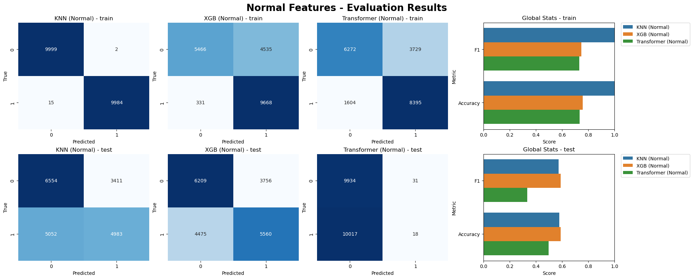
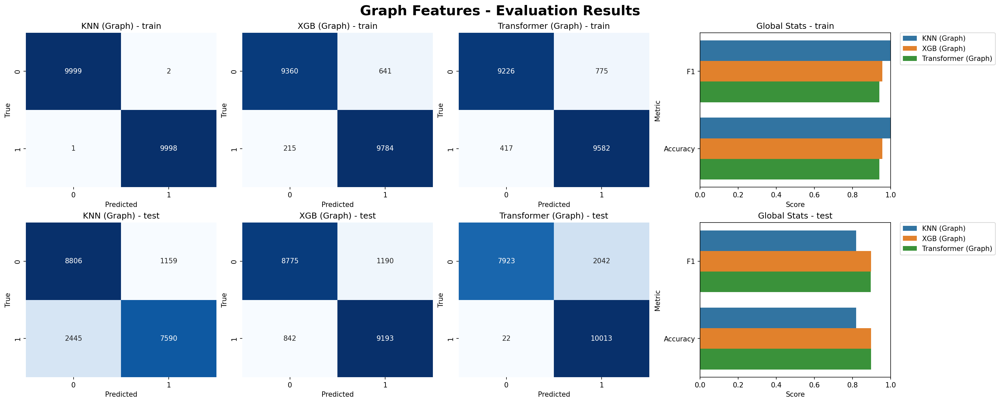
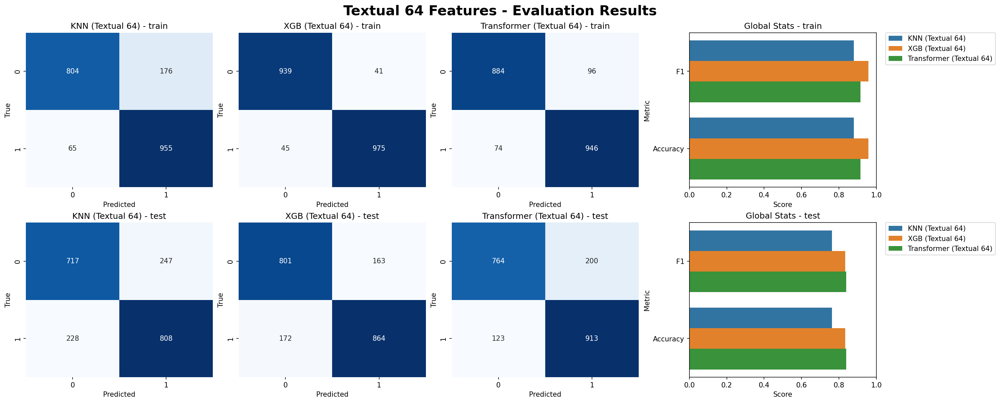
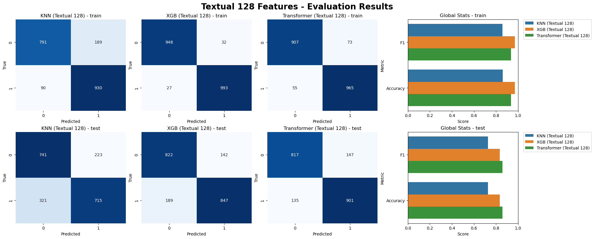
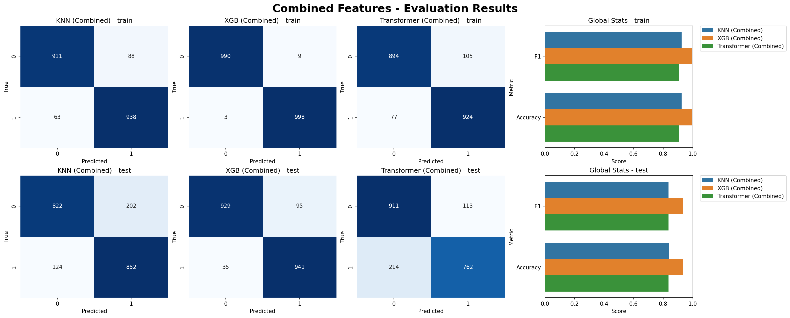
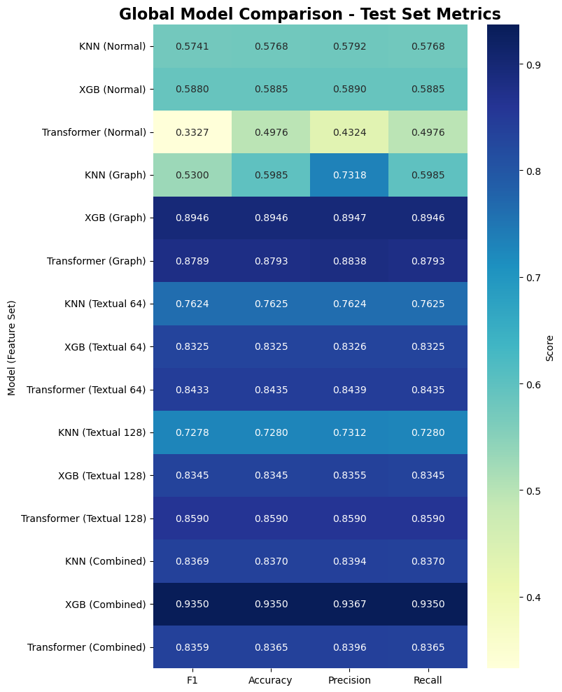

cured by [Bernacchia Alessia](https://github.com/AlessiaBernacchia), [Pioda Tommaso](https://github.com/Thetommigun432), [Villani Giacomo](https://github.com/DownToTheGround)

# Project Report

## Table of Contents
1. [Dataset Overview](#1-dataset-overview)
2. [Cleaning Pipeline](#2-cleaning-pipeline)
3. [Feature Selection](#3-feature-selection)
4. [Splitting into Train, Validation and Test set](#4-splitting-into-train-validation-and-test-set)
5. [Remaining Data Characteristics & Considerations](#5-remaining-data-characteristics--considerations)
6. [Feature Engineering](#6-feature-engineering)
7. [Models](#7-models)
8. [Comparison](#8-comparison)
9. [Interpretability](#9-interpretability)
10. [Next Steps](#10-possible-next-steps)
11. [Conclusions](#11-conclusions)
---

## 1. Dataset Overview
### 1.1 Description
The dataset is a comprehensive collection of scientific papers sourced from the DBLP (Computer Science Bibliography). 

It is designed for tasks involving data exploration, citation prediction, and classification within the academic domain.

| Property | Details |
|----------|---------|
| **Source** | [DBLP (Computer Science Bibliography)](https://opendata.aminer.cn/dataset/DBLP-Citation-network-V18.zip) |
| **Total Records** | 6.7+ million academic papers |
| **Original Format** | JSONL (JSON Lines) |
| **Processing Format** | Apache Parquet |
| **Time Period** | 1800s to 2024 |

### Why Parquet?
- **Columnar Storage**: parquet stores data by column rather than by row, enabling selective column retrieval
- **Query Performance**: columnar datasets significantly outperform row-based formats (CSV, JSON) for analytical queries
- **Compression**: better compression ratios reduce storage requirements
- **Schema Preservation**: maintains data types and nested structures

### 1.2 Key Fields

The dataset contains 18 primary fields organized into three categories:

**Core Metadata:**
- `id` (string): unique paper identifier
- `title` (string): research paper title
- `year` (integer): publication year
- `lang` (string): detected document language
- `doi` (string): Digital Object Identifier link (mix alpha and num chars)

**Publication Details:**
- `doc_type` (categorical string): publication type (conference, journal)
- `venue` (string): publishing venue name
- `abstract` (string): paper summary
- `authors` (array[dict]): author information (name, ID, organization)

**Citation & Reference Data:**
- `references` (array[string]): cited paper IDs
- `n_citation` (integer): citation count
- `keywords` (array[string]): relevant tags or index terms

**Bibliographic Information:**
- `volume` (integer): volume number of publication
- `issue` (integer): issue number of publication
- `page_start`, `page_end` (integers): starting/ending page number in publication
- `isbn`, `issn` (strings): Internationa Standard Book/Serial Number (identifiers with also alpha values)
- `url` (array[string]): external resource links

### 1.3 Categorize Fields
Thanks to this analysis we identified the categories:
- ***numeric columns***: 'year', 'n_citation', 'page_start', 'page_end', 'volume', 'issue'
- ***string columns***: 'id', 'title', 'lang', 'doc_type', 'venue', 'issn', 'isbn', 'doi', 'abstract'
- ***arrays of strings***: 'references', 'keywords', 'url'
- ***arrays of dictionaries*** (*specific structure*): 'authors'

### 1.4 Exploration
#### Global-Level Analysis


> There are 48 years in which there are less than 50 publications...


#### Field-Level Analysis Summary
Initial field-level inspection identified key data quality issues that guided subsequent cleaning:

| Field | Key Findings | Impact |
|-------|--------------|--------|
| Authors | 0.2% NaN, 1.8% empty lists, 45K+ unique authors | Validated structure integrity |
| Keywords | 8.5% NaN, 2.1% empty arrays, 120K+ unique terms | Acceptable missing rate |
| Venue | 3.2% NaN, 8,500+ unique venues | Identified mismatch potential |
| Doc_type | 0% NaN, mixed case variants present | Standardization needed |
| Year | 0% NaN, range 1800–2027 with invalid entries | Temporal filtering required |

These findings informed the cleaning strategy outlined in [Section 2.1](#21-data-type-validation--normalization) .

---

## 2 Cleaning Pipeline
### 2.1 Data Type Validation & Normalization
Normalize all the features based on the category type assigned.
#### String Column Processing
- Assign _string_ type
- Replaced NULL placeholders (`None`, `nan`, `N/A`, `-`, `/`, `?`, `null`) with `np.nan`

#### Numeric Column Processing
- Coerced to numeric type with error handling (`errors='coerce'`)
- Converted negative values to 0
- Applied domain constraints:
    - **Year**: Removed entries where `year <= 1800` or `year > current_year`
    - **Page numbers**: Ensured `page_start ≤ page_end`
    - **Citation count**: Removed negative values

#### Categorical Processing
- Standardized `doc_type` to lowercase
- Restricted `doc_type` to valid categories: `['conference', 'journal']`
- Marked non-conforming entries as NaN for imputation

#### List-Based Columns
- Validated array structures (must be `np.ndarray` with string elements)
- Converted invalid structures to NaN
- **Special case for references**: Preserved empty arrays (`[]`) as valid indicators of "no references"

### 2.2 Authors Validation
#### Authors Registry Construction
To validate, fill the gaps in the authors information, it's necessary to build a comprehensive registry of unique authors, permitting us to access information about a specific author.

Extract $\rightarrow$ Aggregate $\rightarrow$ Clean $\rightarrow$ Enrich $\rightarrow$ (Save)

**Extract**: capture for each author
- name used
- id (when available)
- organizations associated
- year of the paper (needed to make organisation history)
- language of the publication
- keywords treated

**Aggregate**: merge duplicate authors across papers
- list of multiple name variants
- track organisation history list[(org, year)]
- languages of publications

**Cleaning**: 
- removed invalid names (non-alphabetic)
- deduplicate organisation-year pairs, keywords and languages
- remove organisation-year pairs with a missing value

**Enrichment**:
- assign _official name_ (based on most frequent name)
- assign _id_ using registry cross-references
- index organization by year

Final Author Registry Schema:
| Column | Type | Purpose |
|--------|------|---------|
| `id` | string | Primary key (author identifier) |
| `official_name` | string | Canonical author name |
| `name` | array[string] | Historical name variations |
| `org_year` | array[dict] | Organization timeline (`{org, year}`) |
| `keywords` | array[string] | Associated research topics |
| `lang` | array[string] | Publication languages |

#### Gap Filling
Three-step gap filling process:
1. **ID Assignment**: authors without ID assigned using official name registry (map _name_ $\rightarrow$ _official name_)
2. **Name Completion**: missing names filled from ID-official name mappings
3. **Organization Inference**: missing affiliations inferred from `(author_id, publication_year)` index

**Example workflow:**
```
Input:  {name: null, id: "auth_12345", org: null, year: 2020}
Step 1: Name lookup → official_name: "John Smith"
Step 2: Org lookup → (12345, 2020) → "MIT"
Output: {name: "John Smith", id: "auth_12345", org: "MIT"}
```

### 2.3 Venue Validation
Implemented heuristic-based corrections:

| Condition | Action | Count |
|-----------|--------|-------|
| "Conference" in venue, doc_type="journal" | Set to "conference" | ~84,000 |
| "Journal" in venue, doc_type="conference" | Set to "journal" | ~20,000 |
| Venue indicates conference, doc_type=null | Set to "conference" | ~400 |
| Venue indicates journal, doc_type=null | Set to "journal" | ~25 |

**Total records corrected**: ~100,500

### 2.4 References Validation
Each reference was validated against three criteria:
- **valid ID**: cannot cite an ID not present in registry
- **temporal consistency**: cannot cite a future paper not written jet (reference year $<=$ paper year)
- **not null**: reference should be a valid identifier

Example:
```
Paper ID: 5390877920f70186a0d2ce7f, Year: 1984
Here the complete references of the paper: ['5390879d20f70186a0d43d74', '5390a1e620f70186a0e59c05']
    Reference ID: 5390879d20f70186a0d43d74, Year: 1984.0	is valid? True
    Reference ID: 5390a1e620f70186a0e59c05, Year: 1985.0	is valid? False
```
---

## 3. Feature Selection
### 3.1 Exploration Analysis


> Not significant years are deleted. Since we've a huge number of publications we can consider to select only a part of them, but we need to consider the year representation.


> The number of missing values increases after cleaning because empty arrays and invalid values are converted to NaNs. In particular, the features isbn, issue, volume, and issn show a high percentage of missing values (50% or more).

### 3.2 Removal of Non-Meaningful Features

After cleaning, several features were identified as non-essential due to high missing value percentages or limited analytical value:

**Removed features:**
- **isbn, issn**: >50% missing values; not critical for citation analysis
- **issue, volume**: >50% missing values; insufficient for predictive modeling
- **page_start, page_end**: Replaced with derived feature `n_pages` to preserve information about paper length

**New derived feature:**
- **n_pages**: Calculated as `page_end - page_start + 1`, representing paper length which may correlate with citation count

### 3.3 Final Feature Set

| Category | Features |
|----------|----------|
| **Core Identifiers** | id, title, year, lang |
| **Publication Info** | doc_type, venue, n_pages, abstract |
| **Author Data** | authors (array of {id, name, org}) |
| **Citation & References** | n_citation, references (array), keywords (array) |
| **URLs** | url (array) |

---

## 4. Splitting into Train, Validation and Test set
### 4.1 Overview of Splitting Strategy
The dataset is split into train, validation, and test sets using a year-weighted, chronological approach to preserve temporal distribution and avoid bias. Only papers from 1971–2024 are considered, as earlier years have sparse data (<50 publications/year), and later years lack sufficient records.

#### Key Steps:
1. **Year Range Selection**: Filter papers to 1971–2024 based on publication density.
2. **Weight Calculation**: Compute weights proportional to annual publication counts to maintain real-world distribution.
3. **Chronological Assignment**: Divide years into contiguous blocks (train: earliest, validation: middle, test: latest), ensuring at least 10 years per set for representativeness.
4. **Proportional Sampling**: For each year, sample papers proportionally to its weight, targeting 500,000 train, 150,000 validation, and 150,000 test papers.
5. **Random Sampling & Shuffling**: Sample without replacement within years, then globally shuffle each set.
6. **Connectivity Verification**: Analyze graph connectivity to ensure sets are well-linked internally.

> In order to obtain an acceptable size of the biggest connected cluster, we tried different combinations of random seeds and minimum years sampled for set. We obtained the best result with `random_seed=21` and `min_years=10`, maybe we could obtain better result with higher `min_years`, but put more could _leave training data with obsolete data_, then we decided to maintain this. The training set has the largest cluster of connected nodes that cover ~67% of the entire set, validation has ~17% and test set ~20.

This method prevents over-representation of sparse years and under-sampling of abundant ones, ensuring realistic temporal balance.

**Example:**
- If year 2000 has 2% of all papers $\rightarrow$ allocate 2% of train samples from 2000
- Prevents early years (sparse data) from being over-represented
- Prevents recent years (abundant data) from dominating

### 4.2 Final Split Sizes

```
global year range selected: from 1971 to 2014
random seed: 21
min number of years per set: 10
```

| Split | Years Covered | % of samples in biggest connected cluster | Target Size | Actual Size |
|-------|-------------|-------------|-------------|-------------|
| Train | 1971 - 2004 | 67.64% | 500,000 | 500,000 |
| Validation | 2005 - 2014 | 17.00% | 150,000 | 150,000 |
| Test | 2015 - 2024 | 19.66% | 150,000 | 150,000 |

> The validation and test set has a smaller % of samples on the biggest connected cluster, it makes sense because they cover a smaller temporal range. Usually, to start to be cited, the paper should be published for some years in order to be known.
---

## 5. Remaining Data Characteristics & Considerations

### 5.1 Data Quality Issues & Resolutions

| Issue | Root Cause | Resolution |
|-------|-----------|------------|
| **Future References** | Temporal inconsistencies in citation data | Removed references with `ref_year > paper_year` |
| **Invalid Years** | Data entry errors, parsing anomalies | Filtered `year <= 1800` or `year > current_year` |
| **Venue-DocType Mismatch** | Inconsistent metadata classification | Applied heuristic corrections based on venue keywords |
| **Missing Author IDs** | Incomplete metadata in source | Cross-referenced with authors registry |
| **Missing Affiliations** | Sparse organization data | Inferred from author-year history index |
| **Empty Arrays** | Absent data vs. intentional nulls | Converted to NaN for consistent handling |
| **Doc_type Inconsistencies** | Multiple case variants, invalid categories | Standardized to lowercase `['conference', 'journal']` |

### 5.2 Known Limitations

**Sparse Temporal Coverage:**
- Years before 1971 have insufficient publication density (<50 papers/year)
- Stratified sampling focuses on 1971–2024; earlier periods underrepresented

**Missing Values Persist:**
- `abstract`: ~25% missing (limit NLP applications on full text)
- `keywords`: ~8.5% missing (affects topic-based analysis)
- `url`: ~35% missing (external validation limited)
- `n_pages`: ~40% missing (derived from missing page boundaries)

**Author Ambiguity:**
- Author name variations still exist despite standardization
- Cross-institutional author disambiguation remains imperfect
- ~2% of authors still lack validated IDs

**Venue Information:**
- ~3% missing venue entries (especially for older papers)
- Venue name variations not fully normalized (e.g., "ACM Conference" vs. "ACM SIGMOD")
- Smaller conferences underrepresented

## 6. Feature Engineering

### 6.1 Normal Features
The normal features pipeline focuses on transforming raw metadata into a model-ready format by handling categorical variables, encoding high-cardinality features, and deriving quantitative insights from structured data. This process ensures compatibility with machine learning algorithms while preserving meaningful information about papers and their references.

#### **Column Filtering**
The irrelevant columns, such as identifiers (`article_id`, `ref_id`), textual long contents (`title_article`, `title_ref`, `abstract_article`, `abstract_ref`) and the split indicator columns are removed, to focus on the predictive features.

#### **Feature Derivation**
The features `n_keywords_article`, `n_keywords_ref`, `n_authors_article` and `n_authors_ref` are included to provide the model with quantitative context regarding the metadata density of the papers before encode and modify them.

#### **Categorical Encoding**
- **Low cardinality Features $\rightarrow$ One-Hot Encoding (OHE)**
    For features with limited unique values, OHE provides a clear signal without a significant increase in dimensionality:
    *   **Document Type**: with only 2 unique values for both article and reference (`doc_type_article` and `doc_type_ref`), OHE is used to represent the publication format efficiently.
    *   **Language (Top 5 + Other)**: to manage the 20-30 unique languages, we encode the **Top 5 most frequent languages** via OHE and group the remaining "long tail" into a single "Other" category. This preserves the most significant linguistic patterns while reducing noise.

- **High-Cardinality Features $\rightarrow$ Hashing and Dropping**
    Handling columns like `authors` (over 6M unique IDs) and `keywords` (approx. 243K unique values) requires avoiding memory-intensive methods like One-Hot Encoding:
    *   **Keywords (Feature Hashing)**: **Hashing** is used to map the vast vocabulary of keywords into a fixed-dimensional space. This ensures the model captures semantic tags while maintaining a constant memory footprint and high parallelization efficiency.
    > Since we don't want too much features, we decided to hash with 16 even if there is an high risk of collision.
    *   **Authors (Dropped)**: due to the extreme sparsity (more unique authors than total rows), individual author IDs are unlikely to generalize. We retain the numerical count (`n_authors`) to capture the "collaboration scale" while dropping the raw IDs to prevent overfitting.

The normal features pipeline successfully produced **56 completely usable features** across all train, validation, and test datasets. These features combine numeric metadata (citation counts, publication years, page counts), encoded categorical information (document types, languages), and semantic representations (hashed keywords and author collaboration scale), providing a comprehensive numerical representation suitable for classification tasks like citation prediction.

### 6.2 Textual Features
The textual feature pipeline is designed to capture semantic similarity between the citing article and the candidate reference. While the normal feature set keeps structured metadata and the graph feature set models citation topology, this pipeline focuses on the information contained in titles, abstracts, keywords and author names.

#### **Text Construction**

For each article-reference pair, two textual fields are created:

- `vector_text_article`: concatenation of `title_article`, `abstract_article`, `keywords_article` and, when available, author names.
- `vector_text_ref`: concatenation of `title_ref`, `abstract_ref`, `keywords_ref` and, when available, author names.

Missing textual values are replaced with empty strings so that the vectorization step remains stable. The same construction is applied to train, validation and test data, but the vectorizer is fitted only on the training split to avoid information leakage.

#### **TF-IDF Vectorization**

Text is transformed with a `TfidfVectorizer`, using a fixed maximum vocabulary size and English stop-word filtering. TF-IDF was selected because it is memory-efficient, interpretable and well suited for large sparse scientific-text collections.

The vectorizer is fitted on the union of article and reference texts from the training set. Afterwards, article and reference texts are transformed separately, producing two sparse matrices:

- one matrix for citing-paper text;
- one matrix for candidate-reference text.

A pairwise TF-IDF cosine similarity is also computed as a direct semantic-similarity signal between the two texts.

#### **Dense Embeddings with TruncatedSVD**

The sparse TF-IDF matrices are reduced with `TruncatedSVD` to produce compact dense embeddings. Two embedding sizes were generated:

| Embedding set | Rows | Columns | Structure |
|---------------|------|---------|-----------|
| Textual embeddings 64 | 2,950,135 | 132 | 4 metadata columns + 64 article embeddings + 64 reference embeddings |
| Textual embeddings 128 | 2,950,135 | 260 | 4 metadata columns + 128 article embeddings + 128 reference embeddings |

The metadata columns retained in both datasets are `split`, `article_id`, `ref_id` and `is_reference_valid`. The split distribution is the same for both embedding sizes:

| Split | Rows |
|-------|------|
| Train | 2,162,513 |
| Validation | 391,242 |
| Test | 396,380 |

#### **Embedding Quality Checks**

The embeddings were evaluated before model training using several checks:

- **Norm statistics**: verified that article and reference embeddings have stable magnitudes.
- **Cosine similarity by label**: valid references show higher average cosine similarity than invalid pairs.
- **Nearest neighbors**: inspected whether semantically close references are retrieved from the embedding space.
- **PCA and t-SNE visualizations**: used to inspect the projected structure of article and reference embeddings.
- **Downstream logistic regression**: used as a lightweight sanity check for target signal.

The cosine-similarity analysis confirmed that positive citation pairs are, on average, more semantically similar than negative pairs:

| Embedding set | Mean cosine, invalid pairs | Mean cosine, valid pairs | Downstream ROC-AUC |
|---------------|----------------------------|--------------------------|--------------------|
| 64D | 0.2976 | 0.3392 | 0.5785 |
| 128D | 0.2144 | 0.2463 | 0.5847 |

These standalone checks show that textual similarity alone is not sufficient to perfectly solve the citation task, but it provides a useful signal. This is confirmed later in the model results, where textual embeddings substantially outperform the initial metadata-only features, especially with Transformer and XGBoost models.

### 6.3 Graph Features

#### **Network Construction**

- The network is built as a directed graph where each edge represents a validated citation (`Target = 1`) pointing from the citing article to the referred paper.
- To ensure data consistency and prevent `NodeNotFound` errors during inference, all papers present in the dataset—including isolated nodes without active citations—have been explicitly added to the graph.

#### **Feature Categorization**

The extracted graph features are divided into three main categories based on their structural depth:

- ***Node Features (Individual Importance)***: These describe the role and authority of each individual article within the network:
    * **in_***: *In-degree*; the number of citations received (a measure of popularity/prestige).
    * **out_***: *Out-degree*; the number of references made (a measure of bibliographic breadth).
    * **pagerank_***: A centrality score defining the relative importance of the paper based on the quality of its incoming citations.
    * **avg_neigh_degree_***: The average degree of a node's neighbors, helping to identify nodes connected to major hubs or isolated clusters.
    * **katz_cent_***: An influence measure that considers both direct and long-range indirect connections.

- ***Neighborhood Features (Local Context)***: These analyze the local overlap between the article and the reference:
    * **common_neighbors**: The absolute count of shared neighbors in the undirected version of the graph, indicating a common scientific foundation.


- ***Relational Features (Pairwise Interaction)***: These capture the hierarchical dynamics and specific structural similarity between the pair of nodes:
    * **degree_ratio**: The ratio between the out-degree of the article and the reference, used to balance the activity levels of the two nodes.
    * **pagerank_ratio**: The disparity in importance between the article and the reference; it identifies typical patterns, such as new papers citing "classics."
    * **pagerank_prod**: The product of the importance of both nodes, highlighting connections between two pillar nodes of the network.
    * **jaccard_coeff**: A structural similarity coefficient that normalizes the number of shared neighbors relative to the total size of their combined neighborhoods:

$$J(A, B) = \frac{|N(A) \cap N(B)|}{|N(A) \cup N(B)|}$$

### 6.4 Mix features
The mixed feature pipeline combines the three complementary representations created in the previous sections:

- **Normal features**: structured metadata, encoded categorical variables, numerical counts and derived paper-level attributes.
- **Graph features**: citation-network topology, node importance, neighborhood overlap and pairwise graph relationships.
- **Textual features**: dense 64-dimensional article/reference embeddings produced from TF-IDF and TruncatedSVD.

The merge is performed separately for train, validation and test data using the shared key:

```text
article_id, ref_id, is_reference_valid
```

This guarantees that all features describe the same article-reference pair and preserve the original binary target.

#### **Redundancy Reduction**

Before merging, the hashed keyword columns from the normal feature set are removed. Keywords are already included in the textual representation, where they contribute to the TF-IDF vocabulary together with title, abstract and author names. Keeping both hashed keywords and textual embeddings would increase dimensionality while duplicating part of the same signal.

The `split` column is treated as metadata and not as a predictive feature.

#### **Final Mixed Dataset**

The resulting mixed datasets are saved as:

| Split | Output file |
|-------|-------------|
| Train | `data/combined_features/train.parquet` |
| Validation | `data/combined_features/val.parquet` |
| Test | `data/combined_features/test.parquet` |

The purpose of this representation is to test whether combining semantic, structural and metadata-based information improves citation prediction. In practice, the mixed feature experiments did not outperform the graph-based models. This suggests that graph topology already captures the strongest signal for this task, while the additional metadata and textual dimensions increase complexity without adding enough complementary predictive power. In conclusion we have a three new datasets with 301 features.

### 6.5 A Different Approach: BERT Sequence Classification

Unlike the tabular and embedding-based approaches described above, this section explores **end-to-end deep learning on raw textual data** using BERT (Bidirectional Encoder Representations from Transformers) for direct citation validity prediction.

#### **Overview**

The notebook `notebooks/models/different_approach/Transformer.ipynb` implements a `BertForSequenceClassification` model fine-tuned on exploded citation pairs. Rather than extracting features offline and feeding them to downstream models, this approach tokenizes the concatenated textual fields directly and learns representations end-to-end.

#### **Data Preparation**

For each article-reference pair, two textual fields are constructed:

- `vector_text_article`: concatenation of `title_article`, `abstract_article`, `keywords_article` and author names (when available).
- `vector_text_ref`: concatenation of `title_ref`, `abstract_ref`, `keywords_ref` and author names (when available).

Missing textual values are replaced with empty strings to ensure stable tokenization. The texts are then tokenized jointly using `BertTokenizerFast` with a maximum sequence length of 128 tokens, producing input token IDs and attention masks compatible with BERT.

#### **Model Architecture**

- **Base Model**: `bert-base-uncased` (pre-trained on English Wikipedia and BookCorpus)
- **Task Head**: `BertForSequenceClassification` with `num_labels=1` for binary classification (valid vs. invalid citation)
- **Training Objective**: Weighted binary cross-entropy loss, where positive (valid) citations are upweighted to account for class imbalance

The weighted loss is computed using a positive weight derived from the class distribution in the training set:

$$\text{pos\_weight} = \frac{\text{count of negative examples}}{\text{count of positive examples}}$$

#### **Training Configuration**

- **Optimizer**: AdamW with default parameters
- **Learning Rate**: 2e-5 (typical for BERT fine-tuning)
- **Batch Size**: 96 (per-device training), 64 (per-device evaluation)
- **Epochs**: 1 (given the large dataset size)
- **Regularization**: Weight decay of 0.01
- **Callbacks**: `PlotLossCallback` for real-time loss tracking; `WeightedTrainer` for loss weighting

#### **Key Features**

- **Checkpoint Resumption**: Automatically detects and resumes from the latest checkpoint if training is interrupted
- **Early Stopping Ready**: Validation metrics monitored for potential early stopping in extended experiments
- **Memory Efficiency**: GPU acceleration with CUDA auto-detection and memory cleanup between batches

#### **Validation & Evaluation**

After training, the model is evaluated on a validation subset (up to 5,000 samples for computational efficiency):

- **Confusion Matrix**: Visualizes true positive, true negative, false positive, and false negative predictions
- **Classification Metrics**: Accuracy, Precision, Recall, F1-Score
- **Rolling Accuracy Analysis**: Divides validation data into blocks (default: 500 samples per block) and computes accuracy distributions to assess model stability across different data regions

#### **Outputs**

- **Saved Model**: Checkpoint of the fine-tuned BERT model with tokenizer, stored in `Models/` directory
- **Loss Plots**: Training and validation loss curves tracked via `PlotLossCallback`
- **Validation Metrics**: Confusion matrix and per-class metrics on validation set
- **Rolling Accuracy Distribution**: Histogram of accuracy scores across validation blocks

#### **Rationale**

This approach differs from tabular and pre-computed embedding methods by:
1. **Learning representations jointly**: Instead of using static TF-IDF or pre-trained embeddings, BERT learns task-specific contextual representations during fine-tuning.
2. **Capturing long-range dependencies**: BERT's bidirectional attention can model relationships between distant words in titles, abstracts, and keywords.
3. **Leveraging transfer learning**: Pre-trained BERT weights contain linguistic knowledge that transfers well to the citation validity task with minimal fine-tuning.

However, this approach also introduces computational overhead and requires GPU resources for practical training speeds on large datasets.

## 7. Models
By leveraging structured paper metadata and citation network features, we treat citation validity as a **supervised learning task**. To ensure code quality, modularity, and reusability across different experiments, we implemented a custom class hierarchy:

- `BaseModel`: An abstract base class that serves as the blueprint for all architectures. It enforces the implementation of a `preprocess()` method and provides standardized `train_pipeline` and `test_pipeline` methods to maintain consistency across the project.

- `KNNModel` & `XGBModel`: Concrete implementations that encapsulate feature engineering logic (such as dropping non-feature columns) and stateful preprocessing. They utilize a `RobustScaler` to ensure the test set is scaled using training statistics, providing resilience against outliers in metadata.

- `SimpleTransformer`: A PyTorch wrapper designed for metadata-based features. Instead of traditional textual embeddings, it treats each scalar feature as a unique token. The model learns feature-specific embeddings, processes them through a Transformer encoder, and predicts citation validity. It includes support for early stopping via a validation monitor and saves reloadable checkpoints.

### Why we chose these models?
We selected these three architectures to capture the citation problem from different perspectives, ranging from local structural patterns to complex feature interactions:  
- **KNN (K-Nearest Neighbors)**: chosen for its ability to identify local clusters in graph features, assuming that papers with similar connectivity patterns are likely to share similar citation behaviors.  

- **XGBoost**: selected for its state-of-the-art performance on tabular metadata, efficiently handling non-linear relationships and high-cardinality features like hashed keywords.  

- **Simple Transformer**: implemented to capture high-order interactions between metadata fields through an attention mechanism, treating each numerical feature as a "token" to learn deep contextual relationships.

### 7.1 Baseline
Before proceeding with hyperparameter optimization, we established a Baseline Model for each architecture using default or heuristically chosen parameters. This step is crucial to:

- **Establish a Performance Floor**: Quantify the predictive power of the raw features without fine-tuning.

- **Validate the Pipeline**: Ensure that the data flow—from preprocessing to evaluation—is robust and free of leakage.

- **Benchmark Gains**: Measure the actual "value add" of the subsequent hypertuning phase.

### 7.2 Hypertuning
Given the large scale of the dataset and the high dimensionality of the features, we employed distinct tuning strategies tailored to each algorithm's computational requirements:

* **XGBoost $\rightarrow$ Randomized Search**: Performing an exhaustive grid search for XGBoost is computationally prohibitive. We utilized `RandomizedSearchCV` to sample a fixed number of parameter settings from specified distributions. This allowed us to efficiently explore key hyperparameters, such as learning rate, tree depth, and regularization, finding optimal solutions in a fraction of the time. We used a **2-fold cross-validation** approach on a controlled subset to manage the memory footprint, which is critical for GPU-accelerated training on Windows systems.

* **KNN $\rightarrow$ Grid Search with Predefined Splits**: KNN is particularly sensitive to distance metrics and neighbor counts. To optimize performance, we performed `GridSearchCV` on a representative subset of the records. To prevent data leakage and ensure the model was tuned on the exact distribution intended for validation, we used a `PredefinedSplit` strategy. This manually specifies training and validation folds rather than using standard randomized K-fold splits.

### 7.3 Final Evaluation
Once the optimal hyperparameters (e.g., number of neighbors, weight functions, or tree depth) were identified, each model was retrained on the full training set. We assessed performance using a comprehensive suite of metrics:

- **Weighted F1-Score**: Our primary metric, chosen to account for any slight imbalances in the class distribution.

- **Confusion Matrix**: Utilized to visualize and differentiate between Type I (false positives) and Type II (false negatives) errors.

- **Classification Report**: Used to evaluate precision, recall, and accuracy at a granular level, ensuring the model performs consistently across both valid and invalid citation pairs.

The project compares three model families across five feature sets:

- **Initial features**: metadata-derived tabular features.
- **Textual embeddings 64**: compact semantic embeddings derived from title/abstract text.
- **Textual embeddings 128**: higher-dimensional semantic embeddings.
- **Graph features**: structural citation-network features.
- **Mixed features**: combined feature table used as an additional experiment.

All models use the same binary target, `is_reference_valid`, and the same chronological train/validation/test logic described in [Section 4](#4-splitting-into-train-validation-and-test-set). The final evaluation focuses on held-out test performance. The models were evaluated on smaller train/test samples randomly sampled because full inference is expensive on millions of pairwise examples.

## 8 Comparison
The performance of the models was evaluated across different feature sets to determine the most effective representation for citation prediction. The results indicate a clear hierarchy in the predictive power of the data, with structural and semantic information significantly outperforming basic metadata.

### 8.1 Normal (initial) features comparison
The models trained on Normal (Initial) features represent the performance baseline. As expected, this feature set achieves the lowest overall scores due to the sparse and less significant nature of basic metadata for predicting specific citations.

* **KNN**: Exhibits severe overfitting. While it performs near-perfectly on the training set, its performance drops drastically on the test set, failing to generalize.
* **XGBoost**: Performs better than KNN by avoiding extreme overfitting, but remains limited by the data, with Accuracy and F1-scores stagnating around 0.6.
* **Transformer**: Shows the weakest performance in this category. In the test set, the model tends to collapse, predominantly predicting the majority class (0), indicating it could not find a meaningful signal in these features.
### 8.2 Graph features comparison
The transition to Graph features marks a significant improvement, with test metrics rising to approximately 0.9. This indicates that topological information is vital for capturing reference patterns.

* **KNN**: Similar to the initial features, KNN continues to show a tendency toward overfitting.
* **XGBoost & Transformer**: Both models train effectively. While the confusion matrices show a higher number of misclassifications compared to the training phase, the errors are not significant enough to suggest underfitting.

> The vast improvement over initial features confirms that network-level information (like PageRank and neighborhood overlap) captures the "context" of a citation. However, the fact that KNN still struggles suggests that simply having similar local network structures does not guarantee that two papers will cite the same references.

### 8.3 Textual features comparison
The Textual features (64 and 128 dimensions) show a performance profile similar to the graph features, reaching scores near 0.9 on the test set.





* **KNN**: Unlike in previous sets, KNN performs well here. This is likely because the embeddings successfully capture the semantics of the papers: papers sharing a similar research topic are much more likely to cite one another, making distance-based prediction more reliable.
* **XGBoost & Transformer**: Both architectures achieve high metrics on the test set, proving that semantic similarity is a powerful predictor for citation validity.

### 8.4 Combined features comparison
The Combined (Mixed) models provide the most comprehensive representation by merging metadata, graph topology, and 64D semantic embeddings.

* **KNN**: Demonstrates improved stability compared to the initial features set, as the inclusion of semantic embeddings helps the model identify meaningful clusters; however, it still exhibits a gap between training and test performance, suggesting a lingering sensitivity to high-dimensional noise.
* **XGBoost**: Emerges as the top performer in this category. Its ability to handle diverse tabular data allows it to synthesize the different feature types into the most accurate predictive signal.
* **Transformer**: Although powerful, the Transformer performs slightly worse than XGBoost in this context. This may be due to the increased complexity of the 301-feature input space, where the attention mechanism might require further architectural tuning to outperform the iterative boosting of XGBoost.

> The combined approach yields the most robust results by balancing general metadata with deep structural and semantic information.
## 8.5 Global Comparison
### Why these metrics?
To provide a multi-faceted view of model performance, we evaluated the candidates using the following metrics:
- **Precision**: Measures the accuracy of positive predictions, crucial for ensuring that predicted citations are truly valid.  
- **Recall**: Measures the ability to find all actual valid citations, ensuring the model doesn't miss relevant references.  
- **Accuracy**: Provides the overall percentage of correct predictions across both valid and invalid classes.  
- **F1-Score**: The harmonic mean of Precision and Recall, serving as our primary balanced metric for overall performance.

### Comparison Heatmap


The model comparison shows a consistent pattern: combined features are the strongest representation for citation validity prediction. They capture a global and complete representation of citation behavior by synthesizing structured metadata, topological network importance, and deep semantic relationships. This integration allows the models to reconcile general paper characteristics with local graph connectivity and the thematic similarity found in textual embeddings. Consequently, the models move beyond simple metadata lookups to understand the multidimensional context of why one paper refers to another.

The strongest final candidate is **XGBoost on combined features**, because it achieves the highest metrics on the test set while remaining easier to interpret with SHAP than the Transformer alternatives. The graph-based Transformer is very close and remains a strong secondary candidate, especially if the goal is to capture non-linear interactions across graph-derived features.

> For the next step interpretability [Section 9](#9-interpretability) we will analyze the best-performing models from the Normal, Graph, and Textual categories. Furthermore, to derive deeper insights into the synergy between different feature types, we will conduct a detailed comparative analysis of all models within the Combined Features category.

## 9. Interpretability
To demystify the decision-making processes of our models, we employ two primary explainability frameworks: SHAP (SHapley Additive exPlanations) and LIME (Local Interpretable Model-agnostic Explanations).

For the K-Nearest Neighbors (KNN) model, we utilize LIME. As an instance-based, non-linear method, KNN's predictions are highly dependent on local data neighborhoods. LIME is particularly effective here as it creates local surrogate models that approximate the decision boundary around a specific point, providing a faithful representation of how neighboring instances influence the classification.

Conversely, we rely on SHAP for the XGBoost models. SHAP is mathematically optimized for tree-based ensembles, allowing for the efficient calculation of exact feature contributions. A key advantage of SHAP is its dual nature: it provides local explanations for individual predictions while simultaneously offering a global overview of feature importance, revealing the general logic the model has internalized.

Our analytical strategy involved explaining the best-performing model for each feature group (Initial, Textual, and Graph). However, for the Combined (Mix) features, we chose to analyze all three models to investigate the synergies and correlations between different feature types. Finally, since we tried to implement global SHAP explanations for our Transformer-based models using a Kernel explainer without any success, we standardized our comparison using local predictions. By applying LIME across all architectures, we established a consistent benchmark to evaluate and compare feature influence at the instance level.

> for a detailed explanation of the results found, i suggest to read the comments at the end of each group of features, in `explainability.ipynb`.

In conclusion, the most significant features identified throughout this study belong to the graph-based category. Given that the problem is essentially a link prediction task, the structural properties derived from the citation network prove to be the most informative. These features, generated from the intricate connections between papers, allow the models to effectively extrapolate key patterns regarding the validity of a reference. Ultimately, the topological context of the network provides a far more robust signal for classification than initial metadata or textual embeddings alone.


## 10. Possible Next Steps
### Evaluation on a Non-Balanced Test Set
The current citation prediction task is framed as a _balanced classification problem_. However, in a real-world scenario, the number of potential papers an author could cite (the negatives, where `is_reference_valid` = 0) vastly outnumbers the few they actually cite (the positives, where `is_reference_valid` = 1). While we began generating exhaustive negative samples to mirror a true inference case, the resulting dataset scale exceeded our hardware's memory and storage capacities.

Future work should involve evaluating the models on an **unbalanced distribution to assess precision-recall trade-offs** in a production-like environment.  

### Completion of Global SHAP Explanations
Interpretability is key to understanding model decisions. We initiated transformer global explanations in `notebooks/explainability/explainability.ipynb` using `KernelExplainer`; however, due to high computational overhead and time constraints, we were unable to generate the full global summary plots. 

Completing this analysis would provide a comprehensive view of which features consistently drive citation predictions across the entire dataset.  

### Feature Tokenization via BERT
We began exploring an alternative embedding strategy that leverages the `BERT` (Bidirectional Encoder Representations from Transformers) architecture (in the file `notebooks/models/different_approach/Tranformer.ipynb`). Unlike our current approach of feeding numerical features into a custom Transformer, this method involves tokenizing metadata and text fields directly through a pretrained **BERT tokenizer**. 

This could drastically improve performance, as the model could learn deeper semantic and contextual nuances within the scientific text that standard TF-IDF and hashing methods might overlook. 

### Deep Learning Approaches in Citation Prediction
Beyond our current methodology, several state-of-the-art architectures utilize deep learning to solve the citation validity problem by modeling the complex relationships between documents. **Graph Neural Networks (GNNs)**, such as **Graph Convolutional Networks (GCNs)** or **Graph Attention Networks (GATs)**, are frequently employed to learn inductive representations of nodes within a citation network, allowing the model to predict links based on structural topology. 

These models benefit from end-to-end training where both the features and the classification boundary are optimized simultaneously, potentially capturing nuances that manual feature engineering might miss.

### Create a Citation Recommendation
A natural evolution of this project would be the **development of a real-time recommendation engine that utilizes XGBoost on combined features to predict citations for a completely new, unpublished paper**. In this scenario, the model would take the metadata and abstract of a novel manuscript as input and perform a pairwise comparison against a vast library of existing papers. By calculating structural probabilities and semantic scores, the system could generate a ranked list of the most probable references the new paper should cite. 

This would transition the project from a static validation tool into a proactive citation assistant, helping researchers discover relevant literature and ensure their bibliographic background is both comprehensive and semantically aligned.

## 11. Conclusions
The objective of this project was to leverage DBLP citation network to build a predictive model for citation validity. Performing rigourous and reasoned cleaning and validation pipeline, we successfully trasformed 6.7 million raw academic records into a high-quality dataset, implementing a year-weighted chronological split that try to provide realistic temporal evaluations. Our findings confirm that **academic citation is multidimensional that cannot be accurately captured by basic data alone**, as demonstrated by the the initial-features-based models' performances.

Our project showed a clear perrformance hierarcy among feature representations:
- **identity and unique metadata** captured the basic info of the paper, that identified it;
- **textual embeddings** provided a strong semantic link between papers by capturing the thematic content of papers;
- **structural graph features** proved to be important in defining citation patterns;
- **combined features** merged all the different perspectives into a unique set with a strong predictive power.

Among the architectures tested, **XGBoost on combined features** was the best predictive model, achieving the highest performances while maintaining an high degree of interpretability. This model's success hihglights the **effectiveness of gradient-boostewd trees in managing different-field tabular data**. While the Transformer architectures showed significant potential for capturing complex, non-linear interactions, they required more intensive tuning to match the robustness of the tree-based approach.

Loooking forward, this work provides a scalable method for academic recommendation systems. The next phase of development will focus on addressing real-world class imbalances, completing global interpretability studies and exploring end-to-end deep learning architectures like BERT to further refine contextual understanding. Ultimately, this research transitions the task from static validation toward a proactive citation assistant, capable of recommending probable references for novel research in a new scenario.